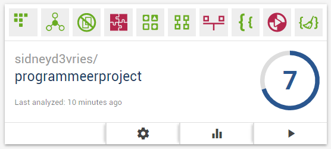

## Summary of tasklist

One of the biggest points with the app was double code, so most of the tasklist was solving that. Further I scored bad on code cleanliness (I forgot some commented code or some Log's). This was quick to fix however and I never had to put it in my task list. Another thing I scored bad on were the unit interfaces, they were too big. I solved most of them but in TabMethods I couldn't find a way to fix it. 
