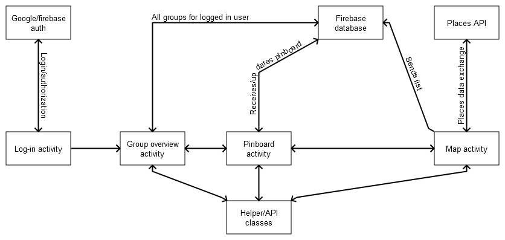

# Design document

## Sidney de Vries

### Activity flowcharts

#### Simple no chat version

#### Version with chat

### Classes

#### Log-in class
Class where all the signing in is done. Will be using the google signup methods, also firebase for storing the list (however this list could also be saved using shared preferences). In the first version of the app this activity is linked with the list activity, however later on this activity will link to the chat overview activity. 

#### Pinboard class
This activity shows an overview of plans that are made. This list is stored using firebase. From this ativity it is possible to go to the map activity, where the user can create a plan to add to the list.

#### Map class
Using the Google Maps Places API it is possible to get placeID's from selected places and store them. Using the getplacebyId function from the api it is possible to recieve information you want from the place. The eventual plan made here is saved on firebase so it can be accessed from the List Class. The user can look for categories of places, or look for a certain name. The list of all places that match the criteria are saved and later used to create the final plan that will be added to the plan list. 

#### Helper class(es)
The Helper Class will contain all methods that are used multiple times, so that you wont have the same method defined in multiple activities. Could be divided in multiple classes if the methods are categorizable. 

### API class
All code that is mostly copy pasted from the API documentation will be put here. This is done to keep code clear and separate own written code and copy pasted code. Could also be divided in multiple classes if the methods are categorizable. 

#### Group overview class
If implemented this class will display data from Firebase to show the groups the logged in user is part of. Here the user can make new groups. This activity links to the pinboard class.

### API's

#### Google Maps Places API
As said earlier the app is going to use the Places API, where the data received can be json or XML. I will probably choose json but this could change if the XML is more useful. This search query contains the location, the range, the type and or name/keywords.

#### Firebase
Firebase is used to save the list of plans. In the non chat version of the app this will be saved as a single column database, where every row is a plan. In the chat version of the app 2 columns are needed because it also has to count the votes of users. The chat database will have two columns, one with the name of the sender, and one with the message. This will be part of the bigger chat overview database, where there will be multiple columns, one with the name of the chat, one with the names of people in the chat, and the id of teh chat, which is linked to the chat database. 
