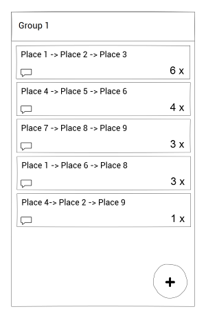
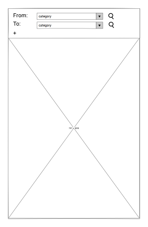

# Programmeerproject

## Sidney de Vries

### Summary
The idea for the app is a pinboard system that makes it easier to plan a night out with friends. This is done by the user who can look for places that match their criteria, (eg. from a bowling alley to a restaurant to a bar for some drinks). However the minimum viable product is being able to do this for one user alone; without the pinboard system. This is because I think the hardest part of this app is getting the google maps api working, and things like logging in with google is something  have already done, so it won’t be as big of a challenge as the maps api. The pinboard system could be seen as an extra, however I am very keen on implementing it, because I think it is an original idea and it makes this app stand out from other apps using google maps api. Extra features to add could be sharing places/plans with non users of the app. Another feature that would be relatively easy to implement could be saving plans on the phone storage.

### Problems and how to solve them
The problem this app will solve is that it makes it easier to plan things in a group, which usually gets really chaotic and confusing. To solve this problem there is a pinboard system where users in a group can post plans. Other users can vote on the plans, this way you can see what plan is the most popular one. Users can add items to and remove items from the list. Users are able to submit multiple votes on multiple items, but not multiple times on the same item.

### Visuals

#### Login screen

#### Group overview

#### Pinboard overview

#### Map interface

### Data and API
The google maps api will be used to get all the places to go, calculate the routes between them (this must be reasonable at first, however the users must be able to change the range of the search). All the data the app will use is from the Google Maps api. The data consists of places to go, the distance between the places and the total range places will be found it (eg. a diameter of 20km). The users are able to change this range. The pinboard will be stored using Firebase, and the users must login with their google account. 

### Parts of the app
The parts of the application are most importantly the group overview interface. Here current groups are shown. From this interface the user can go to the separate pinboard interfaces. Here the user can use a button to open the map interface and look for things to add to the list of plans. This map interface consists of categories to look for and in what sequence.

### Possible problems/limitations
Possible problems I could run into is that the google maps api not giving all the data I need, and in this case another api could be used to get the precise data I need. For example restaurants and bars are a separate category for maps, but something specific like a swimming pool isn’t. This could however be solved by also giving the option to fill something in yourself, instead of choosing from categories.

### Possible extra features
An extra feature to add is to create a route between all selected places. Cities from longitude and latitude (not clicking on map) and implementing a date planner aswell.

### Compared to other apps
A lot of the functionality of this app is already in the standard google maps, however I found that I could only search nearby my current location, and not from a point on a map, which makes it difficult to make plans from home.  Also in the case of wanting to go to multiple places I needed to search for everything apart, remember the places in my head to see if they were relatively close together and sending the plan to a group chat took more effort than it should have taken, this and the pinboard feature makes it different from google maps, which is the app that resembles my app idea the most.
