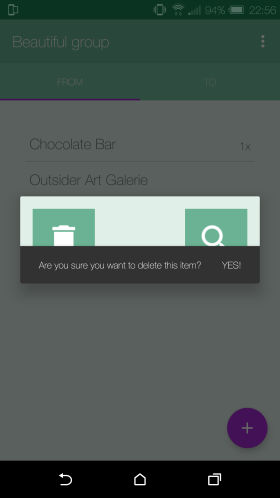
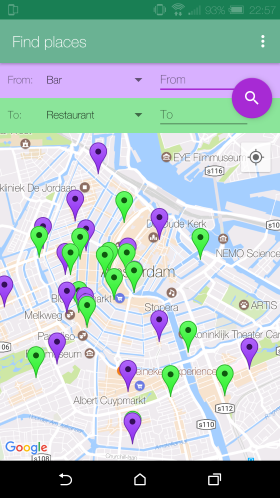

# Plnnr
## Sidney de Vries 

### Purpose

The purpose of this application is to make planning things with a big group easier. This is done by removing clutter data such as a conversation, and only focus on places on a pinboard. Every user can vote once on a place but on multiple places. In the end you can see what place is most popular and you can go there with the help of a built in map.

### Screenshots

Sign in

Group overview

Create a group

Pinboard

Pinboard options

Item dialog

Find on map

Search with categories

Search with text (categories are ignored)

### Sources 

Button icons: 
https://material.io/icons/

Location and permission code:
https://www.androidtutorialpoint.com/intermediate/android-map-app-showing-current-location-android/

Google Places Api for Android: 
https://developers.google.com/places/android-api/

Code quality:
https://bettercodehub.com/

### License

This is free and unencumbered software released into the public domain.

Anyone is free to copy, modify, publish, use, compile, sell, or
distribute this software, either in source code form or as a compiled
binary, for any purpose, commercial or non-commercial, and by any
means.

In jurisdictions that recognize copyright laws, the author or authors
of this software dedicate any and all copyright interest in the
software to the public domain. We make this dedication for the benefit
of the public at large and to the detriment of our heirs and
successors. We intend this dedication to be an overt act of
relinquishment in perpetuity of all present and future rights to this
software under copyright law.

THE SOFTWARE IS PROVIDED "AS IS", WITHOUT WARRANTY OF ANY KIND,
EXPRESS OR IMPLIED, INCLUDING BUT NOT LIMITED TO THE WARRANTIES OF
MERCHANTABILITY, FITNESS FOR A PARTICULAR PURPOSE AND NONINFRINGEMENT.
IN NO EVENT SHALL THE AUTHORS BE LIABLE FOR ANY CLAIM, DAMAGES OR
OTHER LIABILITY, WHETHER IN AN ACTION OF CONTRACT, TORT OR OTHERWISE,
ARISING FROM, OUT OF OR IN CONNECTION WITH THE SOFTWARE OR THE USE OR
OTHER DEALINGS IN THE SOFTWARE.

For more information, please refer to <http://unlicense.org/>
