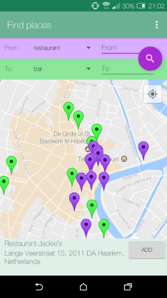
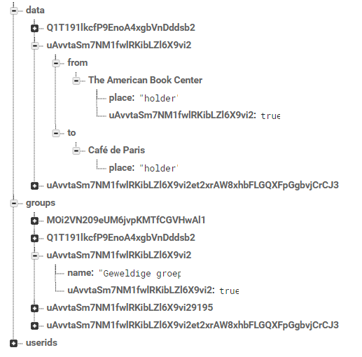

# Plnnr

## Overview

Plnnr is an app that makes it easy to plan a night out with friends. In this app you can create groups, every group has a pinboard where users can post places they want to go to. Other users can vote on these items and this way you can see what plan is most popular. Places are found similar to how you search in Google Maps, but here you can search for multiple places in one time, either places in a certain category, or places matching a text search. 

## Technical design

### High level overview

The first time you open the app you get to the sign in activity. This activity communicates with Google and Firebase for the log in. If the user is succesful the group activity is shown. Here the groups the user is part of are loaded from firebase. When the user selects a group the pinboard activity is shown. Here the data matching the groups identifier is loaded from Firebase and shown. Here dialogs to leave a group, add users or change the group name. From here the user can navigate to the map activity where the Google places API is used to get data, and firebase is used to save the data. See the flowchart for a global visualization of activities and how they work together.

 

### Details

The sign in activity will only move on to the group activity when the google sign in and firebase authorization are complete. 

The group activity loads the groups where the current user is part of. From here the user can make a new group via the new group dialog. If all emails entered in that dialog are users of the app a new group will be created and the groups and data children of the database will be updated. The user can also log out here. This disconnects the user from Google services and the user is redirected to the sign in activity.

Every group has a pinboard activity. This activity has two tab fragments and this is done with a tabspageradapter. Fromtab and toTab are loaded in the pinboard activity. Every tab has its own list of places, which are loaded from firebase in the oncreate. Users can here vote on items, which sends an update to firebase, and then updates the list with the new data. Because this is still part of the pinboard activity the user can use functions such as changing the group name, adding new users or leaving the group. When the group name is changed the child called "name" is simply updated. When an user is added there first needs to be a check to see if the user is valid, when the user is, he/she is added to the group. When the user leaves a group the app checks if the user is the last member of a group. If the user is, the whole group is deleted. If the user isnt, only their userId is removed from the group, so they won't be able to see it anymore.

When the user long clicks an item on the pinboard, a dialog pops up. Here the user can delete an item. This simply sets the value of the child to null, which makes it disappear. The user can also look for the item on the map. This opens the FindOnMap activity. The name of the place is passed to that activity. Here the name is put into a text search query, the async task gets the result of the query and an addMarker method adds the place to the map.

The user can also go to the map activity from the pinboard activity. Here the user can do two things; look for a place matching a certain category, or look for a place matching a text search. Both there queries are queried with the async task, and the results are added to the map with an addMarkers method. When the user clicks a map the onMapClick method responds and shows a view with details of the place. From here the user can add the place to their pinboard.

Certain activities had a lot of double code, mainly the two map activities and the two tab fragments. To solve the double code I created two classes, MapMethods and TabMethods where a the methods are, so I can call them from the activity without having to worry about double code. Especially with the tab fragments this saved a lot of lines. There is also a groupId singleton used to keep a consistent group id when going to the tab fragments. This singleton is updates every time the user goes into a group, and this way Firebase can load the correct data for each group. 

Communication between an activity and their dialogs is done with intents. This intent is usually the groupName and the groupId because those are needed in the changes done in those dialogs, for example changing a groups name or adding a new user. This could also be done with shared preferences, it would probably save a few lines of code, but while debugging I found that using intents was easier. 

There are also two list adapters and a tab fragment adapter. The list adapters are used to show the list of the groups a user is part of. This list item consists of the name of the group and a list of the members of that group. This data is queried from Firebase. The other list adapter is responsible for the lists in the tab fragments. Here a list item consists of the name of a place, the amount of votes and if the user voted for an item it colors the background darker.

The search results of the map activities are queried using an async task. The async task returns a jsonObject with a JSONArray of all places matching the search result. To add all those places I iterate over that array and place markers for every place. Every marker has a tag, this tag is the jsonObject with that place's data, so when the place is added to the database I can get all the data I want from that marker tag. 

When creating a group with the createGroupDialog I assign the group a identifier. This identifier is all the userid's of the groupmembers sticked together, because this is relatively unique. But this way if I made two groups with just myself, there would only be one group because the identifier was the same. I fixed this by checking if the group identifier already was in the database, and if it was it just adds a number at the end so the identifier would be unique again. 

#### Firebase
Another important part of my design is my database structure. There are three 'columns'; one with data, one with the groups and one with userid's. The data column has a child for every group. The key of the child is the group id. This child has two children; "from" and "to". If there are items the name of the place is another child. That child has a default child called place holder. This is done so an item doesnt disappear when it loses its last vote. If users votes for the item their userid will be added as a child. This way you can count the votes and see if the current user has voted for the item.

The second column is the groups column. The children of groups are group id's. The group id has a child with the key "name" and the value the name of the group. Further children of the group id are user id's of members of the group.

The final column is the userids column. This has as children userid's of all users, the value of those children are the emails associated with those userid's.

## Challenges
The first challenge was the original idea of a chat room, however this was trying to reinvent the wheel (eg. Whatsapp or Telegram) so I decided to change the chat into a pinboard. This made saving and receiving the data easier and also got rid of the problem of trying to program a real time chat, while the pinboard doesn't have to be real time per se. When using multiple database listeners the fact you only need to retrieve data once prevented a lot of problems such as infinite loops where both database listeners would react to the others change. 

The database structure also had me thinking for quite some time. I started out with trying the things I could find on the internet, and those ideas worked for a big part, but I wasnt quite satisfied, so I decided to design my own structure, inspired by those examples online, and I finally got to the database structure I described before. 

Another thing I had problems with was getting all the Google services working, but it turned out I forgot to turn the API's on, so that was solved quickly. A problem I had with firebase was that you can't request things such as a name or email from other users, only yourself. This was a problem with showing the other members of your group. I solved this by writing a method that saved the user's id and the user's email in separate 'column'. This way I could get the email of other users with their id. Another thing I had a problem with was the amount of search results a query gave. Because the app uses the free version of the api, I am limited to 1000 search results per day. One search can now show at most 20 places so I dont have to pay for this service. 

Another problem is something that is out of my power, and that is a bug (mainly happened with the emulator) that a user is signed in with Google, but not with Firebase so the app would get stuck in an invite loop because you need to be logged in on both platforms before you can continue. Another challenge was asking user for location permission, because this often made my app crash, but when I relocated the place where this permission was asked the problem was solved.

The final big challenge was trying to get rid of double code during the refactoring. All methods used in the tabs were copied, so I put them in a new class called TabMethods. A problem I found there was that a lot of functions relied on a context, so I had to give all those methods an extra parameter Context. Those methods also used a firebase database instance and a user, so that too were extra parameters to those methods. In the end I solved the problem of double code, but the methods in this class have a lot of parameters because of all the things I have to pass to the methods to make them work. 

## Decisions
As mentioned before the first big decision I made was changing from a chat system to a pinboard system, but Im very glad I did it because I think it gives the app a bit more originality and also saved me some time trying to get a real time chat working. Another important decision I made was the structure of my database. This is something I'm not completely happy with at the moment, because I think it would be nice to save more then just the email of users, their real life name for example. At the moment It would take too much time to rewrite the other code relating to Firebase, so I'm not doing it, but if I had more time I would definitely do this.

Some less big decisions I made were UI related. For example using Snackbars to ask the user for extra confirmation when they want to delete something. I also changed the interface of the pinboard from a single activity to a activity with tabs, this way the lists had more room and it looked nicer aswell. Another small decision was named earlier, but it was asking the user for location permission when they open the app for the first time, instead of when the map activity opened, because this often made the app crash. 

## Things I would do if I had more time

Some things I would add if there was more time are small things to the groups such as group images, a small extra pinboard where users can leave typed messages and I would also like to change the UI in such a way that it actually resembles a pinboard, instead of just a list. I would also like to add an extra activity that shows the group information. This activity would replace the overflow menu and just have all options in that activity.
Another thing I would do is saving more information of the user so I can show the name of a user, instead of their email.
